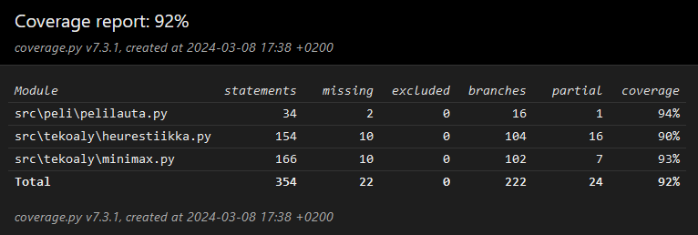
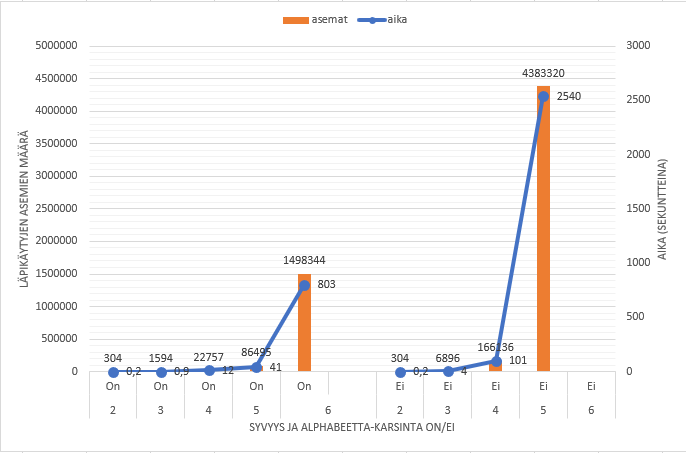

# Testausdokumentti

## Yksikkötestaus

Yksikkötestejä on tehty [heurestiikka.py](/src/tekoaly/heurestiikka.py), [minimax.py](/src/tekoaly/minimax.py) ja [pelilauta.py](/src/peli/pelilauta.py) luokille. [Käyttöliittymä.py](/src/peli/kayttoliittyma.py)- sekä [pelimoottori.py](/src/peli/pelimoottori.py) moduulit jätettiin huomiotta, sillä niitä on epäkäytännöllistä testata yksikkötesteillä.

Tekoälyyn liittyvät testit tehtiin 15x15 pelilaudalle ajan säästämiseksi. Toimintojen pitäisi kuitenkin ollan samat kuin 25x25 laudalla.

## Manuaalitestaus

Kaikkia projektin moduuleita on testattu manuaalitestattu. *peli*-hakemiston moduuleissa testaus keskittyi pelin perustoimivuuteen. Koitettiin syöttää virheellisiä syötteitä ja erilaisia laitatapauksia.

*tekoaly*-hakemiston moduuleissa manuaalitestaus on keskittynyt tekoälyn pelitaitoihin. 

Ohjelman kokonaistoimintaa on myös testattu pelaamalla peliä itsessään, jossa kaikki moduulit ja luokat ovat käytössä.

## Testikattavuus



## Kattavuusraportti

Yksikkötestit ja kattavuusraportin voi tarkistaa itse seuraavilla komennoilla projektin juurihakemistossa:

1. Suorita komento ```poetry shell```
2. Suorita komento ```coverage run --branch -m pytest src```
3. Suorita komento ```coverage html```
4. Poistu shellistä komennolla ```exit```

Raportti löytyy sijainnista *tiralabra/htmlcov/index.html*, jonka voit avata selaimellasi.

## Suorituskykytestaus

Suorituskykytestausta tein pelaamalla ensimmäisen siirron X-pelaajana syötteellä "10 10". Testauksen tein omalla pöytäkoneellani.

Kaavio suorituskykytestauksen tuloksista



Kaaviosta huomaa, että aika, sekä läpikäydyt aseman nousevat erittäin nopeasti kun laskentasyvyyttä nostetaan. Alphabeetta karsinta kuitenkin tehostaa paljon.

On myös huomattava, että ilman alphabeettakarsintaa tehdyistä testeistä jäi syvyyden 6 testi tekemättä kokonaan liian pitkään kestävän ajan vuoksi. (Olisi mennyt karkeasti laskien noin 6-7 tuntia.)
