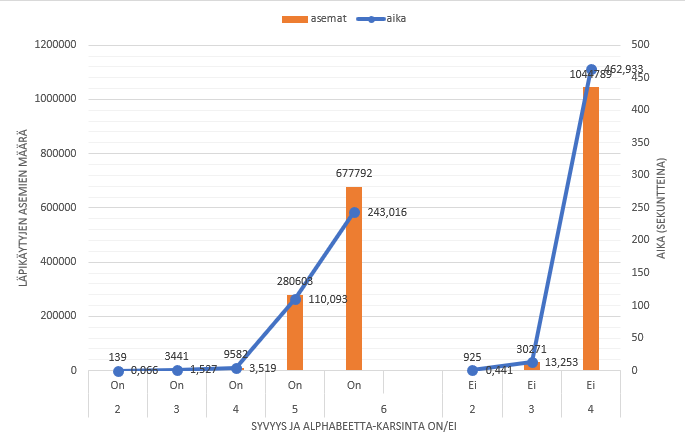

# Testausdokumentti

## Yksikkötestaus

Yksikkötestejä on tehty [heurestiikka.py](/src/tekoaly/heurestiikka.py), [minimax.py](/src/tekoaly/minimax.py) ja [pelilauta.py](/src/peli/pelilauta.py) luokille. [Käyttöliittymä.py](/src/peli/kayttoliittyma.py)- sekä [pelimoottori.py](/src/peli/pelimoottori.py) moduulit jätettiin huomiotta, sillä niitä on epäkäytännöllistä testata yksikkötesteillä.

## Manuaalitestaus

Kaikkia projektin moduuleita on testattu manuaalitestattu. *peli*-hakemiston moduuleissa testaus keskittyi pelin perustoimivuuteen. Koitettiin syöttää virheellisiä syötteitä ja erilaisia laitatapauksia.

*tekoaly*-hakemiston moduuleissa manuaalitestaus on keskittynyt tekoälyn pelitaitoihin. 

Ohjelman kokonaistoimintaa on myös testattu pelaamalla peliä itsessään, jossa kaikki moduulit ja luokat ovat käytössä.

## Testikattavuus


## Kattavuusraportti

Yksikkötestit ja kattavuusraportin voi tarkistaa itse seuraavilla komennoilla projektin juurihakemistossa:

1. Suorita komento ```poetry shell```
2. Suorita komento ```invoke coverage-report```
3. Poistu shellistä komennolla ```exit```

Raportti löytyy sijainnista *tiralabra/htmlcov/index.html*, jonka voit avata selaimellasi.

## Suorituskykytestaus

Suorituskykytestausta tein pelaamalla ensimmäisen siirron X-pelaajana syötteellä "10 10" ja seuraavan siirron syötteellä "10 11". Tekoälyn ensimmäinen siirto oli kovakoodattu aina kordinaatteihin "9 9" ja suorituskykyä testatessa laskettiin tekoälyn toista siirtoa. Testauksen tein omalla pöytäkoneellani.

Kaavio suorituskykytestauksen tuloksista



Kaaviosta huomaa, että aika, sekä läpikäydyt aseman nousevat erittäin nopeasti kun laskentasyvyyttä nostetaan. Alphabeetta karsinta kuitenkin tehostaa paljon.

On myös huomattava, että ilman alphabeettakarsintaa tehtýjätestejä tehtiin vain syvyyteen 4 saakka. Syvyydellä 5 olisi kestänyt karkeasti laskettuna noin 450 minuuttia eli vajaat 5h 30min.
