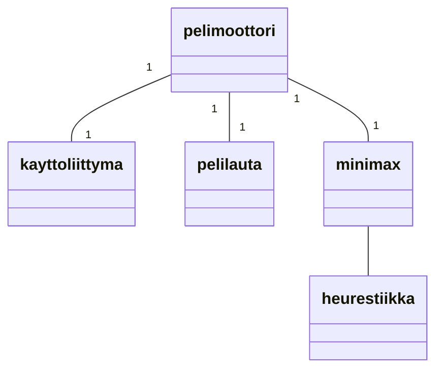
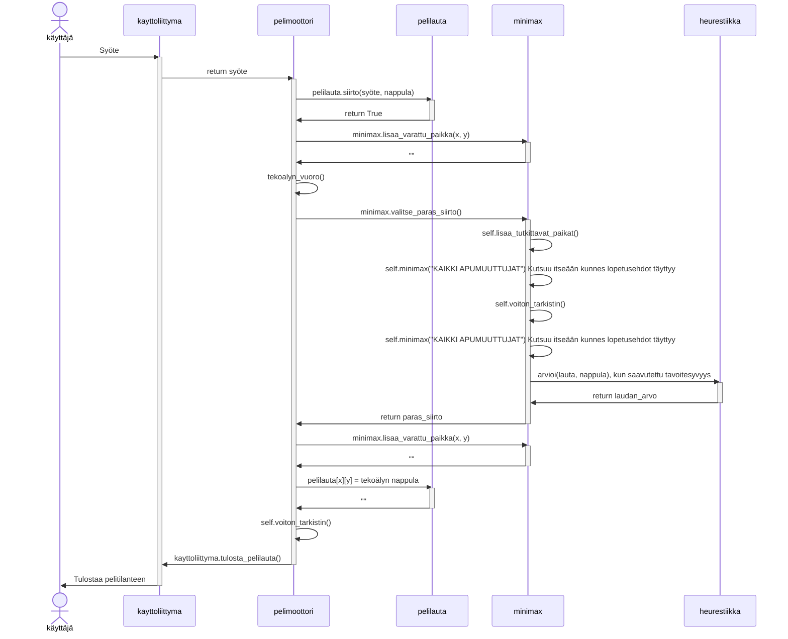

# Toteutusdokumentti

## Rakenne

Korkealla tasolla ohjelma on jaettu kahteen osaan. [Peli](/src/peli/) ja [tekoäly](/src/tekoaly/). Peli-osa vastaa käyttöliittymästä sekä pelin pyörittämisestä itsestään. Tekoäly-osa taas vastaa ohjelman algoritmillisesta puolesta.

### Luokkarakenne

### Toiminnallisuutta

Peli on alkanut ja siirtoja on tehty X määrää. On pelaajan vuoro tehdä siirto.

## Puutteet ja parannusehdotukset

1. Tekoälyn pelitaidoissa on parantamisen varaa ja se on myös hitaampi kuin toivoisin. Tilanteesta riippuen jopa liian hidas.
2. Vaikeusasteen voisi tehdä muutettavaksi syvyyttä kasvattamalla ja pienentämällä. Nyt kuitenkin syvyyden kasvatus tekee tekoälystä hitaan.
3. Graafinen käyttäliittymä olisi kiva.

## Aika- ja tilavaativuudet

Minimaxin aikavaativuus on O(mahdollisten siirtojen määrä^syvyys)ja alphabeetta karsinnalla se on O(mahdollisten siirtojen määrä^(syvyys/2)).

Suorituskykytestauksen löytää [testausdokumentin](./testausdokumentti.md) *Suorituskykytestaus* osiosta.

## Kielimallien käyttö

Kielimalleja käytettiin työn alussa asiaan perehtymiseen ja projektin hahmotteluun korkealla tasolla. Kaikki koodi sekä dokumentaatio on kuitenkin tehty täysin ilman kielimalleja.

## Lähteet

- [Minimax, Wikipedia](https://en.wikipedia.org/wiki/Minimax)
- [Minimax set 1, geeks for geeks](https://www.geeksforgeeks.org/minimax-algorithm-in-game-theory-set-1-introduction/)
- [Minimax set 4, geeks for geeks](https://www.geeksforgeeks.org/minimax-algorithm-in-game-theory-set-4-alpha-beta-pruning/)
